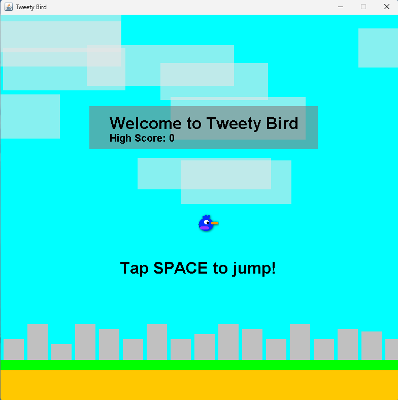
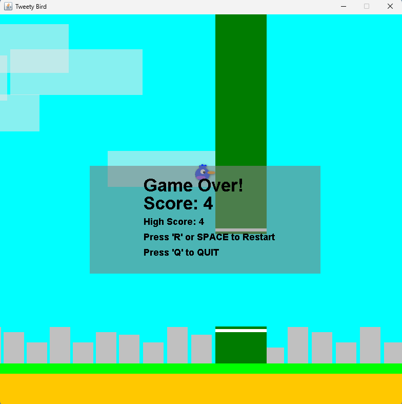

# Software Engineering Class Final Reflection

## Table of Contents

- [Product Vision](#product-vision)
- [Learning and Growth Journey](#learning-and-growth-journey)
  - [Reflection](#reflection)
- [Product Showcase](#product-showcase)
  - [Elevator Pitch](#elevator-pitch)
  - [Product Demo](#product-demo)
  - [Technical Architecture Overview](#technical-architecture-overview)
  - [Codebase Exploration](#codebase-exploration)
  - [Access Your Work](#access-your-work)
- [Final Reflection Presentation](#final-reflection-presentation)
- [Career Readiness Assessment](#career-readiness-assessment)

## Product Vision

FOR casual gamers seeking addictive entertainment WHO crave immersive experience, Tweety Bird is an endless runner game THAT delivers an adrenaline escapade through dynamic environments and obstacles. UNLIKE other endless runner games, OUR PRODUCT offers a unique blend of intuitive swipe controls and simple, yet addictive, ensuring each run is a captivating adventure that keeps players coming back for more.

## Learning and Growth Journey

 - Braillee - we really struggled to communicate in this class and our problems were only worsened by Christian leaving thankfully we were able to come together at the end try and get something together.

### Reflection

Reflect on your journey in learning software engineering through concrete scenarios:

1. **Team Collaboration Approach:**
   - We were unsuccessful in using Trello and teams to try and communicate with other the only thing that really even gave us any hope was discord and we were able to use it to communicate and share files.

2. **Challenges and Overcoming Them:**
   - unfortunately our idea became impossible once I realized that the insight rover which we were going to get our info from was no longer functional unfortunately I did not realize this until I actually tried to call info from the api.

3. **Accomplishments and Pride:**
   - Braillee - I was able to create the menu and get a character icon working as well as compiling the game into an executable .jar file

4. **Learning and Growth:**
   - I wasn't in class much but my group convinced to at least turn something I'm glad I did, they pushed to do more and I really appreciate that as a person that often doesn't like to ask for help I felt I could at least rely on them a bit.

## Product Showcase

### Elevator Pitch

- We spend enough time mindlessly scrolling through our phones how about instead you play a simple game that will waste your time but at least won't steal your data.

### Product Demo

Share simple examples of your product's functionality:

- **Example 1:** Once you die you can either restart or continue to play.
- **Example 2:** We keep track of your high score so you can brag to your friends you are then them.

### Technical Architecture Overview

Simplify a technical concept with an example:

- **Example:** The app calls the show menu operator and pulls up a small menu which shows you your score, high score, and asks if you would like to restart or quit.

### Codebase Exploration

- **Example:** We track your high score a text file hat updates every time that your current score goes above the previous high score

### Access Your Work

- **[Presentation Slides](link-to-presentation):** Share a link to your final presentation slides.
- **[Source Code Repository](link-to-repo):** Provide access to your source code repository.
- **Other Materials:** Include links to diagrams or documents you created for your project.

  

  

  

## Final Reflection Presentation

-Braillee - I have much to learn about managing a team and working on an important project in group and if I could go back I would tell myself that my original idea was doomed from the beginning 

- **Duration:** 25-minute minimum, 40-minute maximum

  

## Career Readiness Assessment

Answer the following questions with practical examples:

1. **Team Collaboration Skills:** Reflect on a time when coordinating with team members improved a project's outcome or efficiency.
 - Braillee - We unfortunately did not collaborate that well together 
2. **Problem-Solving Abilities:** Share a situation where you had to troubleshoot a technical issue and how you approached the problem-solving process.
 - Braillee - There was a while that the game as increasing the score by 42 instead of 1 and then crashing but this was because of a faulty for loop 
3. **Contributions to the Project:** Discuss a specific task you contributed to and how your involvement positively impacted the project's development.
 - Braillee - I crated the menu and made it translucent 
4. **Applied Knowledge:** Describe a technical concept learned in class that you've used in your project, highlighting its practical relevance.
 - Braillee - 
5. **Adaptability and Learning:** Provide an example of a challenge you faced that required learning a new skill or concept, and how you adapted to overcome it.
 - Braillee - Well we had to completely pivot with our whole plan and I think we did a decent job given ome of our restrictions
